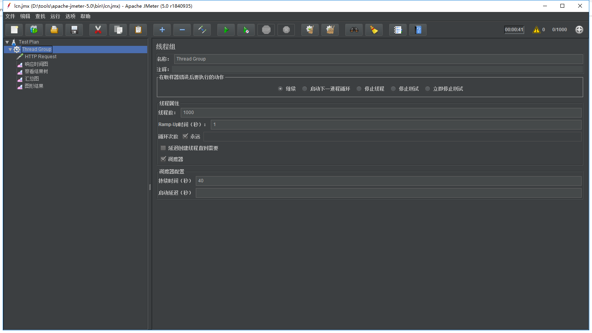
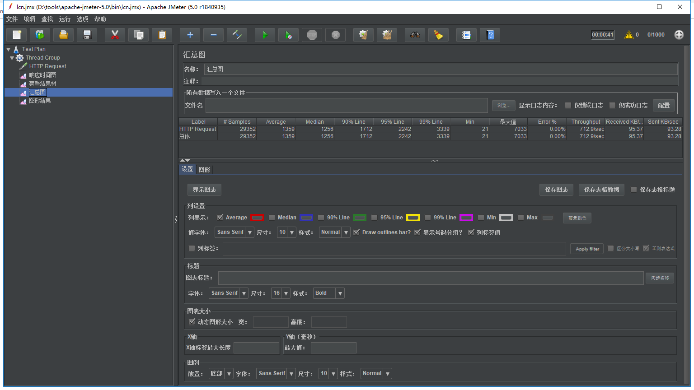
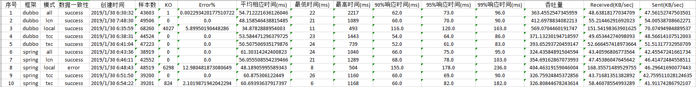

# TX-LCN 5.0.0.RC2 性能测试报告

## 方式说明

Dubbo下测试:   
D1. 在Dubbo下测试单LCN模块在并发20情况下循环请求的吞吐能力。   
D2. 在Dubbo下测试单TXC模块在并发20情况下循环请求的吞吐能力。   
D3. 在Dubbo下测试单TCC模块在并发20情况下循环请求的吞吐能力。   
D4. 在Dubbo下测试TCC、TXC、LCN混合模块下在并发20情况下循环请求的吞吐能力。   
D5. 在Dubbo下测试本地事务在并发20情况下循环请求的吞吐能力。   

SpringCloud下测试:   
S1. 在SpringCloud下测试单LCN模块在并发20情况下循环请求的吞吐能力。   
S2. 在SpringCloud下测试单TXC模块在并发20情况下循环请求的吞吐能力。   
S3. 在SpringCloud下测试单TCC模块在并发20情况下循环请求的吞吐能力。   
S4. 在SpringCloud下测试TCC、TXC、LCN混合模块下在并发20情况下循环请求的吞吐能力。   
S5. 在SpringCloud下测试本地事务在并发20情况下循环请求的吞吐能力。   

## 测试环境

硬件环境:
CPU: Intel(R) Core(TM) I5-8400 CPU @ 2.80GHz 2.81GHz   
内存: 16G   
硬盘：240G SSD    

软件环境:
系统:win10 64   
JAVA: 1.8.0_181  
Mysql: 5.7.23   
Consul: 1.2.3   
Zookeeper:3.4.9  
Dubbo:2.6.2
SpringCloud:Finchley.SR2

## 测试模块

Client D E 三个模块,Client调用一次D模块在调用一次E模块。  

Client.sayHello() -> D.rpc();   
Client.sayHello() -> E.rpc();   

### 重要配置信息

采用jmeter做的压测

线程配置

结果取值

jvm  -Xms256m -Xmx512m    
连接池大小 均20    
分布式事务框架未启用logger记录  

## 测试结果 

## 测试报告

## 测试说明

在相同条件下各种事务模式的效率关系

TCC > LCN > TXC   

相比本地事务各模式的下降率

| 框架   |     模式    |  下降率|
|----------|:-------------:|:-------------:|
| Dubbo | LCN | 31.3% |
| Dubbo | TXC | 36.1% |
| Dubbo | TCC | 28.6% |
| SpringCloud | LCN | 21.5% |
| SpringCloud | TXC | 27.1% |
| SpringCloud | TCC | 21.5%  |

 